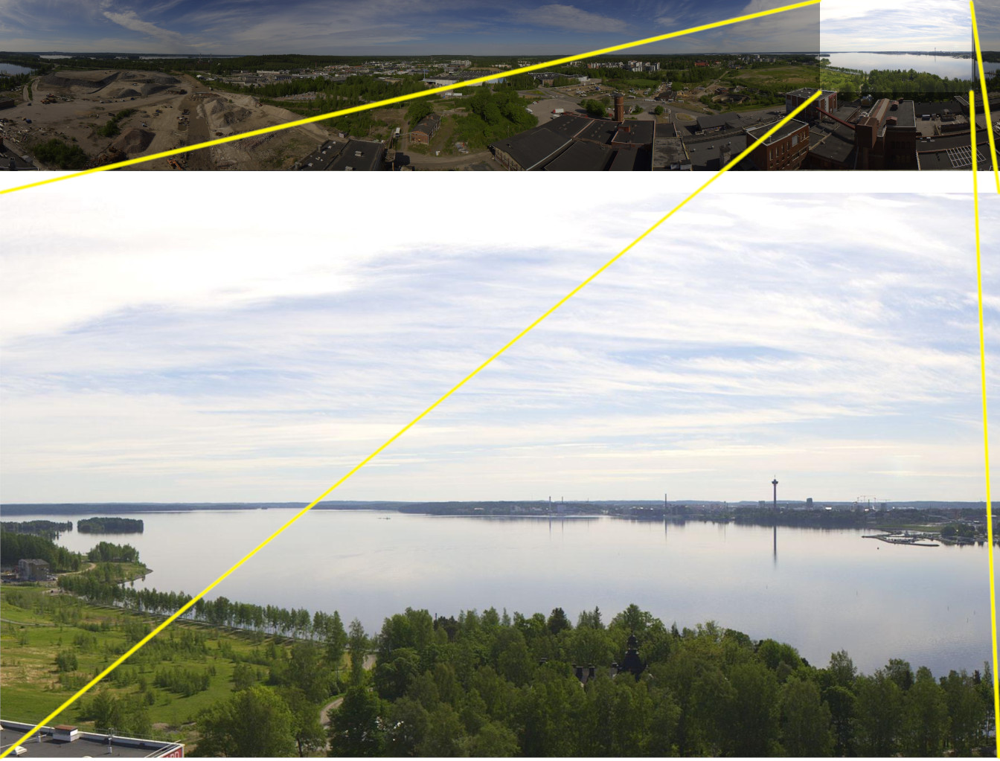

Takes (and crops) image from one of the camera feeds in my hometown and makes it available
at a stable URL and archives the images for me to maybe make automated timelapse videos later.

Runs in AWS Lambda


Published image at
------------------

https://s3.amazonaws.com/files.function61.com/tampere-webcam/hiedanranta/latest.jpg

I show this URL in my constantly-on info display at home.


Why is this open source?
------------------------

This can't directly benefit anyone, as there are many hardcoded details. But I open sourced
this because there might be some details that could help someone:

- Roundshot URL making
- Image cropping
- S3 bucket access
- Lambda function, hybrid one (can directly run locally but also in Lambda)


Cropping
--------

Here's how the original image is cropped:




IAM policy
----------

Good name for inline policy: `putWebcamImages`

```json
{
    "Version": "2012-10-17",
    "Statement": [
        {
            "Effect": "Allow",
            "Action": [
                "s3:PutObject",
                "s3:CopyObject",
                "s3:PutObjectAcl"
            ],
            "Resource": [
                "arn:aws:s3:::files.function61.com/tampere-webcam/*"
            ]
        }
    ]
}
```
